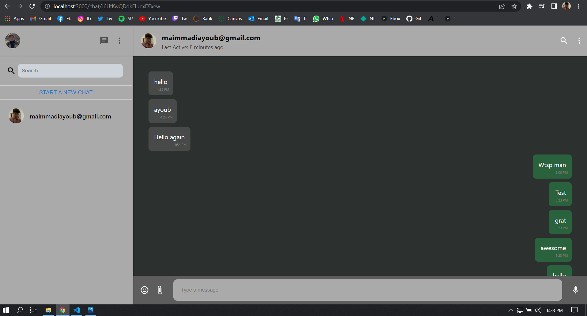

# Whatsapp Clone

## A clone website to Whatsapp using Next and Styled Components.

### You can chat with other user via email, all data stored using Firebase.

To use you need to:

1- Clone or Download this repository

2- Have node.js pre-installed in you computer

3- Launch your IDE and cd into the projct

5- create firebase app and replace the firebaseConfig in firebase.js with your own

6- open terminal and run:

##### - `npm or yarn install` to install node modules

##### - `npm or yarn run dev` to open developement at localhost:3000

##### View -> https://ayoub-whatsapp-clone.vercel.app/
